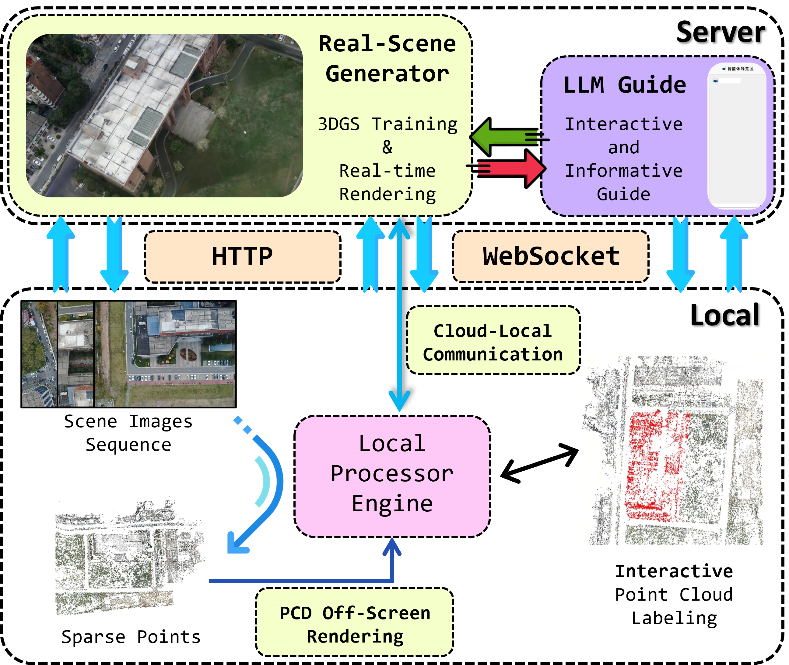

# Informative Scene-Reconstruction App
### *LLM Scene Reconstructor V0.0.1*
A local software and cloud service system that integrates 3D functionalities including **sparse reconstruction**, **point cloud regions annotation**, **3D Gaussian Splatting (3DGS) real-scene model construction *on-cloud***, **real-scene rendering *on-cloud***, and **LLM-agent guidance**. The system can support applications in tourism and disaster overview, and currently supports fast deployment on both Local (Windows 11) and Server (Linux) environments.<br>

<p align="center">
<a href="https://donaldtrump-coder.github.io/">Haojun Tang</a>, Jingran Zhang, Siyuan Zou
</p>
<p align="center">
<a href="https://www.csu.edu.cn/">Central South University</a>
</p>

## 🎞️ Demonstration
### Demo Video (in Chinese)
[Youtube Video Link](https://www.youtube.com/watch?v=kMFJSooMu10)

## 🏠 Sturcture
System Structure:<br>


## 💻 Deployment
### Environments
**Server:**<br>
CUDA = 11.8
```
conda create -n scenereconstruction python=3.9
conda activate scenereconstruction
```
**Local (tested on Windows 11):**<br>
CUDA = 12.4
```
conda create -n scenereconstruction python=3.9
conda activate scenereconstruction
```

### Dependencies and Running
**Server:**
```
pip install torch==2.0.0 torchvision==0.15.1 torchaudio==2.0.1 --index-url https://download.pytorch.org/whl/cu118
pip install -r requirements_server.txt
uvicorn server.main:app --host 0.0.0.0 --port 8000 (Port 8000 on Server needs to be exposed to Local)
```

**Local:**
```
pip install torch==2.4.0 torchvision==0.19.0 torchaudio==2.4.0 --index-url https://download.pytorch.org/whl/cu124
pip install -r requirements_desktop.txt
python main.py
```

## 📒 To-do List

## 🤝 Acknowledgements
Thanks to: [PyQt5]()

## 📝 License and Citation
### License
This project is released under a **Non-Commercial Research License**.<br>
The software is free for academic research and non-commercial use.<br>
Commercial use requires a separate license from the authors.<br>
See the [LICENSE](LICENSE) file for details.<br>
For commercial licensing, please contact:<br>
rs_lover@163.com<br>

### Citation
If you find this project useful in your research, please consider citing:
```bibtex
@misc{tang2026informative,
    title = {Informative Scene-Reconstruction App},
    author = {Haojun Tang and Jingran Zhang and Siyuan Zou},
    year = {2026},
    note={GitHub repository},
    howpublished={https://github.com/DonaldTrump-coder/Informative-Scene-Reconstruction-App}
    }
```